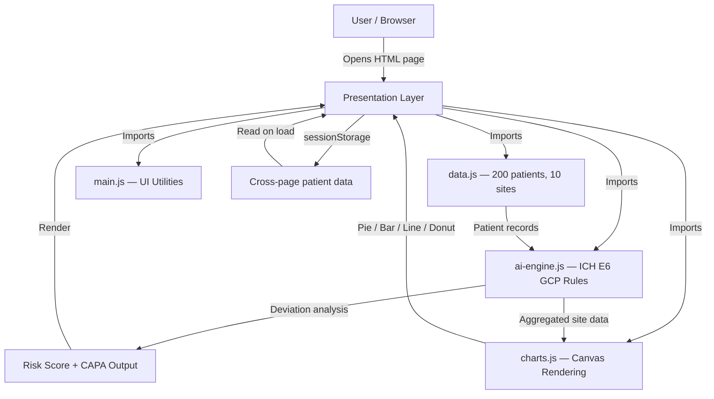

# Architecture — ClinicalAI Monitor
## IBM BoB AI Innovation Hackathon 2026 | Problem P1 | Team Hackaholics

---

## System Architecture

This is a **client-side single-page web application**. All computation runs in the browser — there is no server, no database, and no API calls required.



---

## Components

| Component | Technology | Responsibility |
|---|---|---|
| Home Page | `index.html` + `style.css` | Hero, features, AI workflow overview |
| Main Dashboard | `dashboard.html` + `dashboard.css` | KPI cards, 3 charts, 200-patient table with search/filter |
| Patient Checker | `patient-checker.html` | Form input → real-time AI analysis → risk donut |
| Site Risk Dashboard | `site-dashboard.html` | 10 site cards ranked by aggregate risk score |
| Risk Analysis | `risk-analysis.html` | Full sortable/filterable 200-patient risk table |
| CAPA Generator | `capa-report.html` | Print-ready CAPA report with deviation table |
| AI Engine | `assets/js/ai-engine.js` | ICH E6 rule checks, risk scoring, CAPA recommendation logic |
| Data Layer | `assets/js/data.js` | 200 synthetic patient records, 10 sites, banned meds list |
| Chart Renderer | `assets/js/charts.js` | Pie, Bar, Line trend, Donut — native Canvas API |
| UI Utilities | `assets/js/main.js` | Toast notifications, modals, navbar, scroll-to-top |
| Global Styles | `assets/css/style.css` | IBM Design System tokens, grid, components |
| Dashboard Styles | `assets/css/dashboard.css` | Sidebar, chart containers, table styles |

---

## Data Flow

1. **Page Load** — Browser loads HTML, then `data.js` generates 200 patient records with randomized visit dates, doses, co-medications, and lab/doc status
2. **AI Analysis** — `ai-engine.js` is called with the full patient array; `analyzePatient()` runs 5 rule checks on each record
3. **KPI Calculation** — `computeKPIs()` aggregates totals for the dashboard header cards
4. **Site Aggregation** — `computeSiteRisks()` groups patients by site and computes average risk scores
5. **Chart Rendering** — `charts.js` receives processed data and draws all charts to Canvas elements
6. **Patient Table** — Dashboard iterates all 200 results and renders rows with severity badges
7. **Patient Checker** — User inputs a custom patient record; `analyzePatient()` runs instantly; result renders with CAPA details
8. **CAPA Report** — Patient data passed via `sessionStorage`; CAPA page renders a print-ready regulatory document

---

## AI Engine — Deviation Detection Logic

```
analyzePatient(patient) → { deviations[], riskScore, riskCategory }

Rule 1 — Visit Timing:
  |visitDate - scheduledDate| > 14 days  → Major  (+25 pts)
  |visitDate - scheduledDate| > 7 days   → Minor  (+10 pts)

Rule 2 — Dose Check:
  doseGiven / expectedDose ≥ 2.0 OR ≤ 0.5 → Major (+30 pts)
  any other variance                        → Minor (+10 pts)

Rule 3 — Banned Co-medication:
  comed ∈ BANNED_MEDS                       → Major (+35 pts)

Rule 4 — Laboratory Test:
  labCompleted = "No"                        → Major (+20 pts)

Rule 5 — Documentation:
  docComplete = "No"                         → Administrative (+5 pts)

riskScore = min(sum of weights, 100)
riskCategory:
  0–30   → Low
  31–60  → Medium
  61–80  → High
  81–100 → Critical
```

---

## Security Considerations

- No API keys, credentials, or secrets are stored anywhere in this application
- All data is synthetic — no real patient data is used or stored
- No server-side code — zero attack surface from the backend
- No external CDN dependencies — no third-party script injection risk
- `.env.example` is provided for future backend integration; `.env` is gitignored

---

## Scalability Notes

For production deployment beyond the hackathon prototype:

1. **Backend integration** — Replace `data.js` with REST API calls to a real EDC system (Medidata Rave, Oracle Clinical One)
2. **IBM watsonx.ai** — Augment rule-based engine with `ibm/granite-13b-instruct-v2` for free-text clinical note analysis
3. **Role-based access** — Add authentication layer (IBM App ID / Auth0) with CRA / PI / Sponsor / Regulator roles
4. **Real-time updates** — WebSocket connection for live deviation alerts as site data is entered
5. **Horizontal scaling** — Stateless architecture; any CDN (Vercel, Netlify, IBM Cloud Static Sites) can serve it globally
